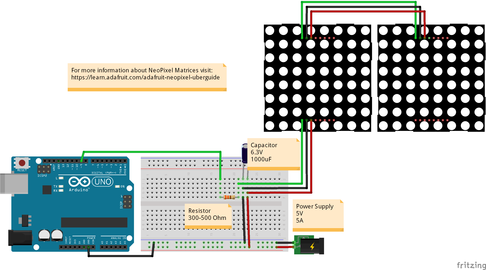

# LED-Matrix-Counter

Last updated: 20171019 by MaLosch

This code is part of the SRAC (Sunrise Alarm Clock) Project by MaLoSch.
Arduino sketch controls two RGB LED Matrices (NeoPixel) and displays an endless, automatic counter from 0-99.

Components:
- Arduino
- Jumper wires
- 300-500 Ohm resistor
- 2X 8x8 RGB LED Matrices (NeoPixel)
- 1 Capacitor 6.3 V 1000uF

For a detailed description on RGB LED matrices, read Adafruits NeoPixel Uberguide - https://learn.adafruit.com/adafruit-neopixel-uberguide

Circuit
